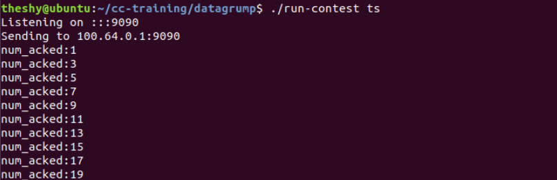

# 开发任务二操作指南

在开发任务1中我们了解到确认报文ACK一般来说是比较小的，但是在传输过程中，每一个包的数据报文的格式都是相同的。开发任务1中我们给出的示例报文头包含了48（8\*6）个字节，因此发送一个ACK也至少需要48个字节，而发送端发送一份数据报文（一般有效载荷约为1400字节），头部也需要48个字节。假设在接收端每接收到一个数据报文就发送一个ACK的情况下，ACK的协议开销是比较大的，此时数据报文与ACK的比例为1：1。

在这样的背景下，有两种方式可以降低ACK的开销，一种是捎带确认，一种是延迟ACK。捎带确认是指在接收端也需要向发送端发送数据时，将需要同时反馈给发送端的ACK信息“捎带”在所有的数据报文中，这样就可以不用单独发送一个确认报文。在本项目中，因为接收端并没向发送端发送有效数据，所以捎带确认暂不作考虑。

延迟ACK是指接收端不必每接收到一个数据报文就反馈一个ACK，而是可以每接收到多个数据报文之后再反馈一个ACK，常见做法为每接收到2个数据报文反馈1个ACK，此时数据报文与ACK的比例为2：1。需要注意的是仅仅控制数据报文与ACK的比例会存在某些情况下ACK迟迟无法发出的情况，例如2个数据报文反馈1个ACK的场景下，如果总的数据报文数量为单数，接收端收到最后一个数据报文时会因为不满足回复ACK的条件而不反馈ACK。这显然是违反常理的，因此延迟ACK同时还存在一种超时机制，即在一定时间内如果没有收到满足发送ACK条件数量的数据报文，超时后也会立即反馈ACK。

因此总结下来延迟ACK机制的反馈ACK规则如下：

- 收到指定数量的数据报文即反馈一个ACK
- 超过一定时间仍未收到指定数量的数据报文，也立即反馈一个ACK

> **注3**：延迟ACK机制中触发ACK的数据报文数量不能太大，因为数据报文数量会影响发送端收到ACK的时机。理论上来说发送端越及时收到ACK，对RTT的估计越准确。当此处指定的数据报文数目过大时，会让发送端收到ACK的时机进一步地被延迟，从而影响拥塞控制等等。

延迟ACK机制被人形象的表示为一种"赌博"：接收端打赌会在超时时间范围内收到指定数量的数据报文，如果赌赢了就可以获得因为延迟ACK机制而少发了一些ACK带来的额外收益，赌输了就会让发送端滞后了一个超时长度才能收到ACK。

# 开发任务：

请你修改 `receiver.cc` 来实现延迟ACK（**只要求实现收到指定数量的数据报文即反馈一个ACK的功能，不要求实现超过一定时间仍未收到指定数量的数据报文也立即反馈一个ACK的功能**），并在 `controller.cc` 中打印ACK序列号进行验证。

## 提交要求：

提交修改后的 `receiver.cc` 以及设计说明书一份。代码要求一人一码，严禁抄袭！

## 设计说明书要求：

要求写清楚任务目标、任务实施过程中的必要细节，包括但不限于算法细节描述、机制原理说明和过程结果截图等。

## Tips:

在 `controller.cc` 中打印ACK的序列号，可以在 `controller.cc` 中的 `ack_received` 函数中，添加 `cout<<"num_acked:"<<sequence_number_acked<<endl;` 进行打印。

`controller.cc` 中的 `ack_received` 函数编写的是收到一个ACK后的动作，其中 `sequence_number_acked` 变量是已经被确认的数据报文的序列号。

下图是每接收到2个数据报文反馈1个ACK的结果示意图：

可以看出，1号数据报文（报文序号从0开始）、3号数据报文、5号数据报文……被依次确认收到，即每2个数据报文反馈1个ACK。