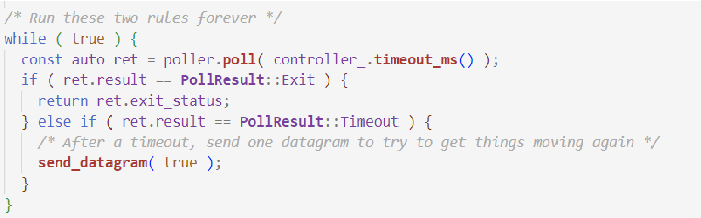
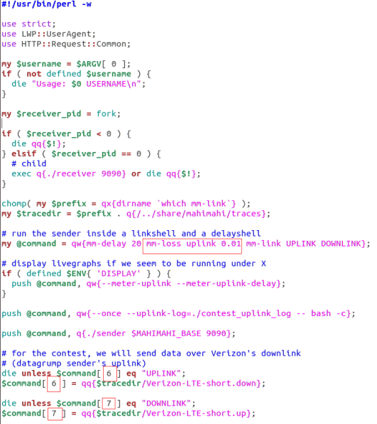
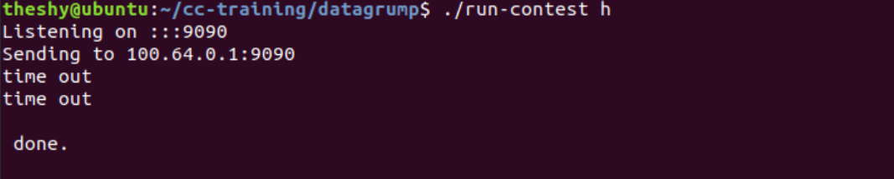
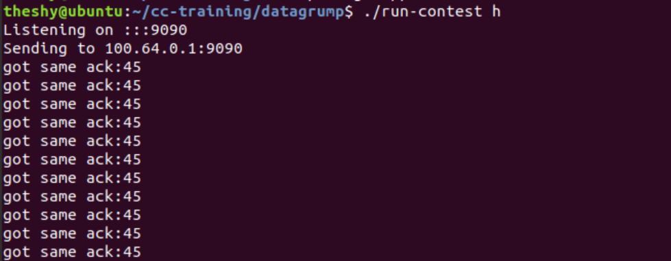

# 开发任务三操作指南

之前的开发任务中谈及的都是在理想情况下发送端发送数据，接收端接收数据的场景。但是在网络通信中，不可避免的会有数据报文在传输过程中丢失。网络中的数据报文丢失可能由于多种原因，例如网络拥塞、传输介质故障、路由器故障等。检测丢失的数据报文对于确保数据的可靠传输至关重要，对于设计一个可靠传输协议也是如此。

接收端收到每一个新的数据报文时都会反馈一个ACK给发送端，但是在发生丢包时，应该反馈什么ACK呢？目前协议中的ACK发送规则是每收到一个数据报文时，接收端的反馈是当前收到的数据报文序列号，而接收端在向上层应用层递交数据时是需要确保数据有序的，所以必须确保数据是按序接收而不能有空缺。因此在发生丢包时，即使丢失报文的后续数据已经到达，接收端也会在后续报文对应的确认报文中反馈的是丢包前收到的数据报文序列号，也即是最后一个按序收到的序列号，因此丢包会让发送端接收到多个确认号相同的ACK（重复ACK）。发送端可以利用这种机制快速的检测出哪些报文已经丢失。

TCP中使用的丢包检测的方法主要有两种，分别是：

- **超时检测**：这是一种基本的方法。当发送方发送一个数据报文后，启动一个计时器。如果在规定的时间内未收到接收方的确认（ACK），则认为数据报文丢失。然而，超时时间的选择是一个关键问题，过短可能导致误判，而过长则可能延长检测丢包的时机。
- **重复ACK**：当接收方收到乱序的数据报文时，它可能会发送一个重复的ACK，通知发送方已经收到了这个数据报文。发送方通过检测重复ACK可以迅速识别哪些数据报文丢失。

> **注1**：在现实情况中，接收端收到的数据报文号如果发生了乱序，例如路由变化导致某些包的传输时间相比其他包大幅增长，这时发送端如果迟迟收不到接收方对于这些包的ACK，那么也会根据丢包检测规则判定这些乱序的包可能已丢失。

以上两种TCP中常使用的丢包检测方法虽然十分简单有效，但在漫长的使用过程中人们也发现了他们的一些缺点，例如超时检测的触发时间选择、重复ACK无法有效解决尾丢包等等问题，因此研究人员们近年来也提出了一些新的检测算法，其中典型的检测算法是RACK算法：

**Recent Acknowledgement (RACK)**：如果发送端收到的确认报文中的 SACK选项确认收到了一个数据报文，那么在这个数据报文之前发送的数据报文要么是在传输过程中发生了乱序，要么是发生了丢包。RACK使用最近接收成功的数据报文的发送时刻来推测在这个数据报文之前传输的且未收到的数据报文是否已经过期(expired)，RACK会把这些过期的数据报文标记为丢失。

> **注2**：SACK是指"Selective Acknowledgment"，即选择性确认。在计算机网络中，特别是在TCP（Transmission Control Protocol）协议中，SACK是一种机制，允许接收方在确认收到的数据报文时报告已成功接收的部分，而不仅仅是报告最后一个按序到达的数据报文的序号。

## 开发任务

1. 在 `controller.cc` 中的 `datagram_was_sent()` 函数里实现检测是否发生了超时，如果发生了超时，打印 `"timeout"` 信息并修改窗口大小。

   > **注3**：超时检测已经在发送端 `sender.cc` 中的 `loop()` 函数里实现，如图一所示，如果发生了超时，会执行 `send_datagram(true);` 语句，其中参数 `true` 传给了 `controller.cc` 文件中的 `datagram_was_sent()` 函数，此时，该函数中的 `bool after_timeout` 的值被置为 `true`，标记发生了超时。
   >
   > **注4**：窗口大小是指发送端发送数据的窗口大小，如果发生了超时，说明当前网络的状况并不好，为了进一步减少拥塞，应当减少窗口的大小，少发数据。

   

   - **tip1**：可以在 `controller.cc` 中新定义一个全局变量 `WindowSize` 表示窗口大小，当发生了超时，就将这个变量减半。

2. 阅读 `receiver.cc` 和 `contest_message.cc` 中的 `transform_into_ack()` 部分，在 `receiver.cc` 中实现重复ACK，并在 `controller.cc` 中的 `ack_received()` 函数里实现对重复ACK的检测，如果发现了重复ACK就输出 `"got same ack"` 和该ACK确认的序列号。

   > **注5**：要分清报文头里几个序列号的关系。`header.sequence_number` 是发送方发送的数据报文的序列号，由发送方维护。`header.ack_sequence_number` 是接收端反馈的当前收到的数据报文序列号。`receiver.cc` 里也有一个 `sequence_number`，这是接收方维护的ACK的序列号，在这个实验里我们并不关心它。

   - **tip2**：`transform_into_ack()` 里的逻辑是将当前接收端收到的报文序列号 `header.sequence_number` 传给 `header.ack_sequence_number`，用来确认当前报文已经收到，所以要对 `header.ack_sequence_number` 的改动，就要在 `receiver.cc` 里对 `header.sequence_number` 进行改动。（`contest_message.cc` 是管理报文的格式，实现重复ACK不要在这里改动，尽量在 `receiver.cc` 里改动）可以在 `receiver` 里维护一个 `should_ack_num` 变量，让其与 `message.header.sequence_number` 进行比较，看当前报文是不是应该收到的报文。

   - **tip3**：`ack_received()` 函数里的第一个变量 `sequence_number_acked` 就是 `header.ack_sequence_number`，可以在 `controller.cc` 里全局维护一个 `last_ack` 变量用来实现重复ACK检测。

3. 行有余力的同学可以尝试实现RACK。

## 提交要求

提交修改后的 `receiver.cc` 和 `controller.cc` 以及设计说明书一份。代码要求一人一码，严禁抄袭！

## 设计说明书要求

要求写清楚任务目标、任务实施过程中的必要细节，包括但不限于算法细节描述、机制原理说明和过程结果截图等。

> **注6**：本次实验只实现丢包检测，并不用关心丢包后的重传问题。
>
> **注7**：如果不改动网络环境，实验过程中只会出现超时检测的情况，设置丢包率后才会出现重复ACK，需要改动 `datagramp` 目录下的 `run-contest` 文件，具体改动如图二所示（改动之处用红框标出，0.01处的丢包率可以自行设置）：



```perl
#!/usr/bin/perl -w
use strict;
use LWP::UserAgent;
use HTTP::Request::Common;
my $username = $ARGV[0];
if ( not defined $username ){
    die "Usage: $0 USERNAME\n";
}
my $receiver_pid = fork;
if ( $receiver_pid < 0 ){
    die qq[51];
} else if ( $receiver_pid == 0 ){
    # chlld
    exec q[./receiver 9090] or die qq[51];
}
chomp( my $prefix = qx[dirname 'which mn-link'] );
my $tracedir = $prefix . q[/share/nahinahit/traces];
# run the sender inside a linkshell and a delayshell
my $command = [qw[mn-delay 20 mn-loss uplink 0.0] , qw[mn-link UPLINK DOWNLINK]];
# display livegraphs if we seem to be running under X
if ( defined $ENV['DISPLAY'] ){
    push @$command, qw[--meter-uplink --meter-uplink-delay];
}
push @$command, qw[--once --uplink-log=/contest_uplink_log -- bash -c];
push @$command, q[./sender SMASHIMAHI_BASE 9090];
# for the contest, we will send data over Verizon's downlink
# (datagrump sender's uplink)
die unless $command->[6] eq "UPLINK";
$command->[6] = qq[$tracedir/Verizon-LTE-short.down];
die unless $command->[7] eq "DOWNLINK";
$command->[7] = qq[$tracedir/Verizon-LTE-short.up];
```

实验结果示意图如下：


