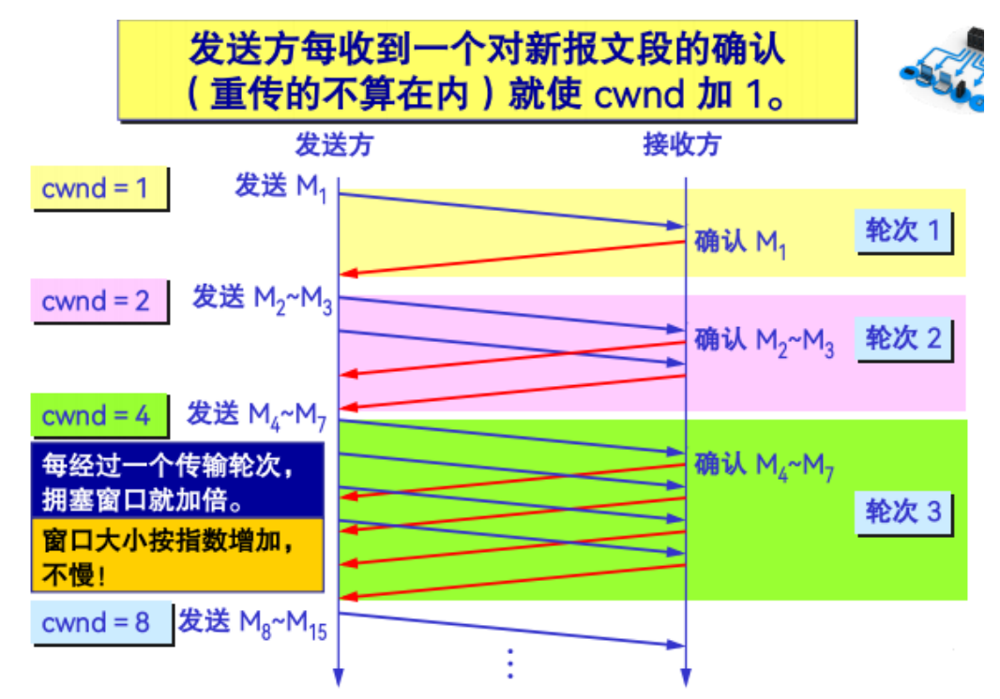
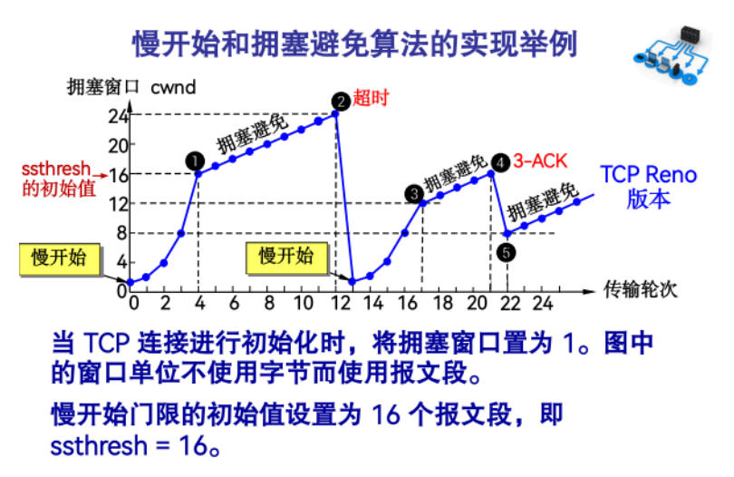
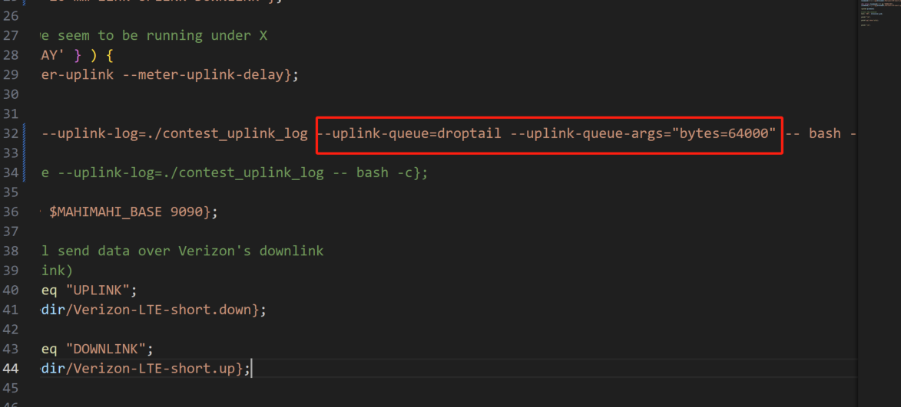
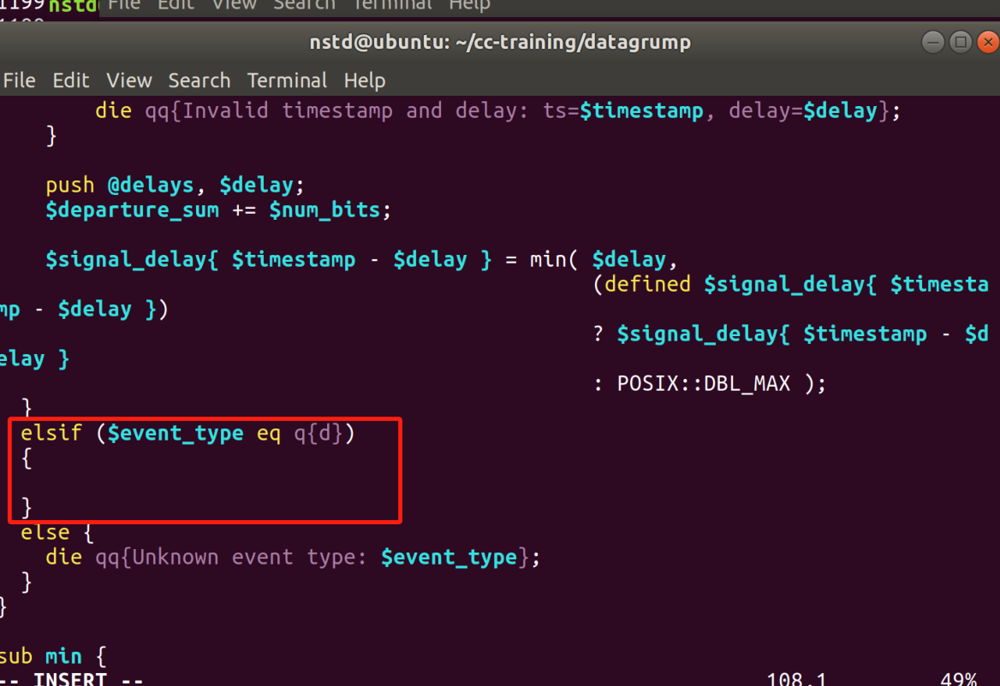

# 开发任务四操作指南

## 1. RTT与RTO

**RTT (Round Trip Time)**：一个连接的往返时间，即数据发送时刻到接收到确认的时刻的差值；  
**RTO (Retransmission Time Out)**：重传超时时间，即从数据发送时刻算起，超过这个时间便执行重传。

TCP连接在重传定时器溢出就会重传数据。溢出时间RTO如果设置过短，会造成重传频繁，加快网络阻塞；设置过长，则会导致性能下降。所以，重传超时计算的算法应该能够反映当前网络的拥塞情况，而每个连接的RTT恰恰能够反映这一点，所以设计好的RTT估计器是计算RTO的第一步。

每收到一个确认ACK，可以根据其中的时间戳计算出一个RTT采样，得到一个SampleRTT。由于路由器的拥塞和端系统负载的变化，在这种波动下，用一个报文段所测的SampleRTT来代表同一段时间内的RTT总是非典型的，为了得到一个典型的RTT，TCP规范中使用如下公式计算得到平滑的RTT估计值（本文中称之为EstimatedRTT）：

$$EstimatedRTT = (1- \alpha) \times EstimatedRTT + \alpha \times SampleRTT$$

一旦获得一个新SampleRTT时，则根据上式来更新EstimatedRTT，其中 $\alpha$ 通常取值为0.125，即：

$$EstimatedRTT = 0.875 \times EstimatedRTT + 0.125 \times SampleRTT$$

每个新的估计值的 $87.5\%$ 来自前一个估计值，而 $12.5\%$ 则取自新的测量。

在最初的RTO算法中，RTO等于一个值为2的因子与RTT估计值的乘积，即：

$$RTO = 2 \times EstimatedRTT$$

但这种做法有个很大的缺陷，就是在RTT变化范围很大的时候，使用这个方法无法跟上这种变化。具体来说，由于新测量SampleRTT的权值只占EstimatedRTT的 $12.5\%$，当实际RTT变化很大的时候，即便测量到的SampleRTT变化也很大，但是所占比重小，最后EstimatedRTT的变化也不大，从而RTO的变化不大，造成RTO过小，容易引起不必要的重传。因此对RTT的方差跟踪则显得很有必要。

在TCP规范中定义了RTT偏差DevRTT，用于估算SampleRTT偏离EstimatedRTT的程度：

$$DevRTT = (1- \beta) \times DevRTT + \beta \times |SampleRTT - EstimatedRTT|$$

其中 $\beta$ 的推荐值为0.25，当RTT波动很大的时候，DevRTT的就会很大。

如上面所述得到了EstimatedRTT和DevRTT，很明显超时时间间隔RTO应该大于等于EstimatedRTT，但要大多少才比较合适呢？选择DevRTT作为余量，当波动大时余量大，波动小时余量小。所以最后超时重传时间间隔RTO的计算公式为：

$$RTO = EstimatedRTT + 4 \times DevRTT$$

RTO计算公式总结如下：​

$$\begin{aligned}
EstimatedRTT &= 0.875 \times EstimatedRTT + 0.125 \times SampleRTT (1)\\
DevRTT &= 0.75 \times DevRTT + 0.25 \times |SampleRTT - EstimatedRTT| (2)\\
RTO &= EstimatedRTT + 4 \times DevRTT (3)
\end{aligned}$$

## 2. AIMD

AIMD (Additive Increase, Multiplicative Decrease) 是一种经典的拥塞控制算法，广泛应用于计算机网络中，特别是在TCP拥塞控制中。以下是AIMD算法的概述：

**AIMD算法工作过程：**

1. **慢启动**：初始阶段，发送方以指数增长的速率增加发送窗口的大小，以快速探测网络的容量，提高网络的利用率。每次成功接收一个ACK时，窗口大小增加一。
   

2. **拥塞避免**：当发送方达到一个阈值（门限值 ssthresh）时，进入拥塞避免阶段。此时，发送方以线性增加的速率逐渐增加发送窗口的大小，以缓慢探测网络的容量，并避免网络拥塞。

3. **乘法减少**：每次检测到超时或者其他拥塞信号时，将门限值改为当前窗口值的一半，随后将窗口大小减为1，以避免网络拥塞的加剧。

### 基本流程

1. **初始化**：将拥塞窗口大小（window）设置为一个较小的初始值，例如1。门限值ssthresh初始化为16或你认为合理的值。第一轮EstimatedRTT的值设为第一个数据报文的SampleRTT，之后的EstimatedRTT的值根据公式（1）进行修改。第一轮DevRTT的值设为第一个数据报文SampleRTT的一半，之后的DevRTT根据公式（2）进行修改。

2. **数据发送**：按照当前拥塞窗口大小发送数据包。

3. **ACK接收**：在 `ack_received()` 处，每当接收到一个ACK时，拥塞窗口大小增加一。

4. **拥塞检测**：如果在 `datagram_was_sent()` 处检测到超时或在 `ack_received()` 处检测到丢包，触发乘法减少操作，将门限值ssthresh改为当前窗口值的一半，随后将窗口大小减为1。

5. **循环**：重复步骤2至步骤4，根据网络状况动态调整拥塞窗口大小。

### 开发任务

1. 请你在 `controller.cc` 中完成RTO的计算，并在 `timeout_ms()` 函数处返回你计算得到的RTO。RTO的计算公式可以参考上面的公式(1)(2)(3)，也可以自行设计，合理即可。

2. 请你修改 `controller.cc` 来实现AIMD算法。

### 提交要求

提交修改后的 `controller.cc` 以及设计说明书一份。代码要求一人一码，严禁抄袭！

### 设计说明书要求

要求写清楚任务目标、任务实施过程中的必要细节，包括但不限于算法细节描述、机制原理说明和过程结果截图等。

> **注1**：如果不改动网络环境，实验过程中中间设备的buffer是无限大的，这样就无法触发丢包使得窗口降低，设置buffer大小且设置中间设备的丢包模式为丢弃尾包模式才能使得链路在拥塞的时候发生丢包，需要改动 `datagrump` 目录下的 `run-contest` 文件，具体改动如下图所示（改动之处用红框标出）：
> 
> 

> **注2**：我们需要修改 `/usr/local/bin/mm-throughput-graph` 文件使得该脚本能对有丢包事件的日志进行画图操作，具体改动如下图所示（改动之处用红框标出）：
> 
> 