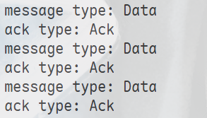

# 实验报告：可靠传输协议报文格式设计

<div style="text-align:center">
    王艺杭<br>
    2023202316
</div>

## 实验任务与目标

### 任务背景

在网络通信中，发送端与接收端需要事先约定统一的通信语法（即报文格式标准），以确保双方能够正确解析和处理数据。本实验针对可靠传输协议的场景，设计并实现一种包含报文类型元数据的报文格式标准。

### 任务目标

1. 理解报文头部设计的原理，掌握如何在有限的空间内高效组织元数据
2. 在现有报文格式基础上添加报文类型（Message Type）元数据
3. 修改相关数据结构、序列化/反序列化方法及接收端代码
4. 实现通过报文类型区分数据报文（Data）和确认报文（ACK）的功能

### 技术要求

- 报文格式需支持可靠传输，包括序列号、时间戳、确认序列号等元数据
- 发送端与接收端须使用相同的报文格式标准
- 代码实现须满足一人一码，严禁抄袭

---

## 实验原理与机制说明

### 报文格式设计原理

在可靠传输协议中，报文（Packet）通常由两部分组成：**报文头部（Header）**和**有效载荷（Payload）**。报文头部携带描述报文特性的元数据，类似于快递单据；有效载荷则是需要传输的实际数据。

报文头部空间是宝贵的资源，头部占用越多，可用于传输有效数据的空间就越少。因此，报文头部的设计需要在功能完整性和空间效率之间取得平衡。

### 可靠传输的核心元数据

本协议采用的报文头部包含以下元数据：

| 元数据字段 | 用途说明 |
|-----------|---------|
| `sequence_number` | 序列号，用于跟踪已发送的报文，支持丢包检测和顺序控制 |
| `send_timestamp` | 发送时间戳，记录报文发出时间，用于计算往返时延（RTT） |
| `ack_sequence_number` | 确认序列号，标识已确认接收的数据报文序列号 |
| `ack_send_timestamp` | 数据报文的发送时间（从接收端反馈），用于RTT计算 |
| `ack_recv_timestamp` | 数据报文的接收时间（接收端本地时钟），用于RTT计算 |
| `ack_payload_length` | 已确认的有效载荷长度，发送端可据此感知已确认的数据量 |

### 报文类型（Message Type）引入的必要性

在原始设计中，数据报文和确认报文（ACK）复用了相同的结构体格式，但未做任何区分。这种设计会导致以下问题：

1. **语义歧义**：接收端无法直接判断收到的报文是数据还是ACK
2. **处理逻辑混乱**：在多路复用场景下，无法正确路由到对应的处理模块
3. **扩展性受限**：未来若需添加其他报文类型（如NACK、SYN等），缺乏统一标识

为解决上述问题，本实验在报文头部引入了`type`字段作为报文类型元数据。

### 报文类型设计

采用枚举类型（enum class）定义报文类型，确保类型安全：

```cpp
enum class MessageType : uint64_t {
  Data = 0,  // 数据报文
  Ack = 1,   // 确认报文
};
```

---

## 实验过程与实现细节

### 修改 `contest_message.hh`

在`ContestMessage::Header`结构体中添加`type`字段，并声明类型转换函数：

```cpp
enum class MessageType : uint64_t {
  Data = 0,
  Ack = 1,
};

std::string message_type_to_string(MessageType type);

struct ContestMessage {
  struct Header {
    MessageType type;  // 新增：报文类型
    
    uint64_t sequence_number;
    uint64_t send_timestamp;
    uint64_t ack_sequence_number;
    uint64_t ack_send_timestamp;
    uint64_t ack_recv_timestamp;
    uint64_t ack_payload_length;
    
    Header(const uint64_t s_sequence_number);
    Header(const std::string &str);
    std::string to_string() const;
  } header;
  
  std::string payload;
  // ... 其他成员函数
};
```

### 修改 `contest_message.cc`

#### 类型转换函数实现

```cpp
std::string message_type_to_string(MessageType type) {
  switch (type) {
  case MessageType::Data:
    return "Data";
  case MessageType::Ack:
    return "Ack";
  default:
    return "Unknown";
  }
}
```

#### 报文头部解析（从网络字节序）

```cpp
ContestMessage::Header::Header(const string &str)
    : type(static_cast<MessageType>(get_header_field(0, str))),
      sequence_number(get_header_field(1, str)),
      send_timestamp(get_header_field(2, str)),
      ack_sequence_number(get_header_field(3, str)),
      ack_send_timestamp(get_header_field(4, str)),
      ack_recv_timestamp(get_header_field(5, str)),
      ack_payload_length(get_header_field(6, str)) {}
```

解析顺序：`type`作为第一个uint64_t字段存储在网络字节序中。

#### 报文头部序列化（转换为网络字节序）

```cpp
string ContestMessage::Header::to_string() const {
  return put_header_field(static_cast<uint64_t>(type)) +
         put_header_field(sequence_number) + put_header_field(send_timestamp) +
         put_header_field(ack_sequence_number) +
         put_header_field(ack_send_timestamp) +
         put_header_field(ack_recv_timestamp) +
         put_header_field(ack_payload_length);
}
```

#### 转换为ACK报文的逻辑

```cpp
void ContestMessage::transform_into_ack(const uint64_t sequence_number,
                                        const uint64_t recv_timestamp) {
  header.type = MessageType::Ack;  // 修改类型为ACK
  header.ack_sequence_number = header.sequence_number;
  header.sequence_number = sequence_number;
  header.ack_send_timestamp = header.send_timestamp;
  header.ack_recv_timestamp = recv_timestamp;
  header.ack_payload_length = payload.length();
  payload.clear();
}
```

#### 新建数据报文的默认类型

```cpp
ContestMessage::Header::Header(const uint64_t s_sequence_number)
    : type(MessageType::Data),  // 默认类型为Data
      sequence_number(s_sequence_number),
      send_timestamp(-1), ack_sequence_number(-1), ack_send_timestamp(-1),
      ack_recv_timestamp(-1), ack_payload_length(-1) {}
```

#### 判断是否为ACK报文

```cpp
bool ContestMessage::is_ack() const {
  return header.type == MessageType::Ack &&
         header.ack_sequence_number != uint64_t(-1);
}
```

### 修改 `receiver.cc`

在接收端添加报文类型的打印逻辑，以便验证类型字段的正确性：

```cpp
int main(int argc, char *argv[]) {
  // ... socket初始化代码 ...
  
  while (true) {
    const UDPSocket::received_datagram recd = socket.recv();
    ContestMessage message = recd.payload;

    // 打印接收到的报文类型
    std::cout << "message type: " << message_type_to_string(message.header.type)
              << std::endl;
    
    // 转换为ACK并分配新的序列号
    message.transform_into_ack(sequence_number++, recd.timestamp);
    
    // 打印ACK的报文类型
    std::cout << "ack type: " << message_type_to_string(message.header.type)
              << std::endl;

    message.set_send_timestamp();
    socket.sendto(recd.source_address, message.to_string());
  }
  return EXIT_SUCCESS;
}
```

---

## 实验结果与分析

### 功能验证




输出表明：
1. 接收到的原始报文类型正确识别为`Data`
2. 经`transform_into_ack`转换后，类型正确变更为`Ack`
3. 报文类型元数据在序列化和反序列化过程中保持正确

### 报文格式验证

修改后的报文头部共包含7个uint64_t字段，每个字段8字节，总计56字节：

| 字段索引 | 字段名称 | 大小 |
|---------|---------|------|
| 0 | type | 8 bytes |
| 1 | sequence_number | 8 bytes |
| 2 | send_timestamp | 8 bytes |
| 3 | ack_sequence_number | 8 bytes |
| 4 | ack_send_timestamp | 8 bytes |
| 5 | ack_recv_timestamp | 8 bytes |
| 6 | ack_payload_length | 8 bytes |
| **合计** | | **56 bytes** |

### 设计优势

1. **类型安全**：使用`enum class`避免与整数类型的隐式转换
2. **向前兼容**：新增字段不影响现有数据的解析
3. **扩展性强**：未来可轻松添加新的报文类型（如NACK、SYN、FIN等）
4. **实现简洁**：通过类型系统消除if-else的字符串比较，提升运行效率

---

## 实验总结

本实验成功在可靠传输协议的报文格式中引入了报文类型元数据，解决了数据报文与确认报文之间的语义歧义问题。通过修改报文头部结构体、序列化/反序列化方法以及接收端处理逻辑，实现了以下目标：

1. 发送端在创建报文时自动设置默认类型为`Data`
2. 接收端能够正确解析并识别报文类型
3. 确认报文在转换时正确更新类型为`Ack`
4. 运行时可通过日志输出验证类型字段的正确性

该设计为后续实现更复杂的可靠传输机制（如拥塞控制、流量控制等）奠定了基础。
