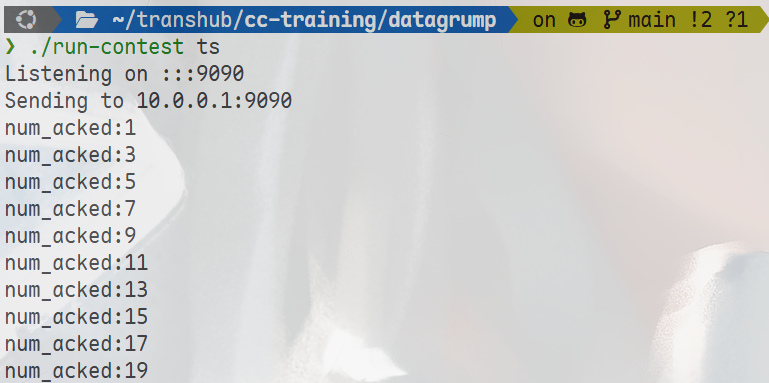

# 实验报告：延迟ACK机制实现

<div style="text-align:center">
    王艺杭<br>
    2023202316
</div>

## 实验任务与目标

### 任务背景

在可靠传输协议中，确认报文（ACK）用于向发送端确认已成功接收数据报文。然而，在原始实现中，接收端每收到一个数据报文就立即发送一个ACK，这种1:1的ACK比例带来了较大的协议开销。由于数据报文和ACK报文具有相同的头部格式（48字节），ACK报文本身也占用相当的网络带宽。

### 任务目标

1. 理解延迟ACK机制的工作原理
2. 修改 `receiver.cc` 实现延迟ACK功能（每收到2个数据报文反馈1个ACK）
3. 在 `controller.cc` 中打印ACK序列号进行验证
4. 验证数据报文与ACK的比例达到2:1

### 技术要求

- 只实现收到指定数量的数据报文即反馈一个ACK的功能
- 不要求实现超时机制
- 代码实现须满足一人一码，严禁抄袭

---

## 实验原理与机制说明

### 延迟ACK机制原理

延迟ACK是一种减少ACK协议开销的优化技术。其核心思想是：接收端不必对每个收到的数据报文都立即发送ACK，而是累积多个数据报文后统一发送一个ACK。

**延迟ACK的工作机制：**

1. **累积确认**：接收端维护一个计数器，记录已收到但尚未确认的数据报文数量
2. **阈值触发**：当计数器达到预设阈值（通常为2）时，发送一个ACK确认所有累积的数据报文
3. **计数重置**：发送ACK后，重置计数器为零

### 延迟ACK的优势

| 指标 | 普通ACK | 延迟ACK（2:1） |
|------|---------|----------------|
| 数据报文:ACK比例 | 1:1 | 2:1 |
| ACK协议开销 | 较高 | 降低50% |
| RTT估计延迟 | 无 | 略有增加 |

### 延迟ACK的"赌博"特性

延迟ACK机制被形象地比喻为一种"赌博"：
- **赌赢**：在超时时间内收到足够数量的数据报文，减少ACK开销
- **赌输**：未能收到足够数量的数据报文，导致ACK延迟发送

本实验仅实现阈值触发机制，未实现超时机制。

---

## 实验过程与实现细节

### 修改 `receiver.cc`

在接收端实现延迟ACK逻辑，每收到2个数据报文发送1个ACK：

```cpp
uint64_t sequence_number = 0;
uint64_t packet_count = 0;
const uint64_t ACK_INTERVAL = 2;  // 每2个数据包发送1个ACK
uint64_t last_ack_seq = 0;
uint64_t last_ack_timestamp = 0;
Address last_dest_addr;
string last_message_str;

/* Loop and acknowledge every incoming datagram back to its source */
while (true) {
  const UDPSocket::received_datagram recd = socket.recv();
  ContestMessage message = recd.payload;

  packet_count++;
  last_ack_seq = sequence_number++;
  last_ack_timestamp = recd.timestamp;
  last_dest_addr = recd.source_address;

  message.transform_into_ack(last_ack_seq, last_ack_timestamp);
  message.set_send_timestamp();
  last_message_str = message.to_string();

  // 只有达到阈值时才发送ACK
  if (packet_count >= ACK_INTERVAL) {
    socket.sendto(last_dest_addr, last_message_str);
    packet_count = 0;
  }
}
```

**实现要点：**

1. **计数器变量**：`packet_count` 用于记录已收到的数据报文数量
2. **阈值常量**：`ACK_INTERVAL = 2` 表示每2个数据报文触发一次ACK
3. **状态保存**：保存最后一个数据报文的信息（序列号、时间戳、目的地址、消息内容），以便达到阈值时发送
4. **触发条件**：当 `packet_count >= 2` 时发送ACK，然后重置计数器

### 修改 `controller.cc`

在发送端的ACK接收回调函数中添加打印语句，验证ACK序列号：

```cpp
void Controller::ack_received(
    const uint64_t sequence_number_acked,
    const uint64_t send_timestamp_acked,
    const uint64_t recv_timestamp_acked,
    const uint64_t timestamp_ack_received) {
  
  cout << "num_acked:" << sequence_number_acked << endl;

  if (debug_) {
    cerr << "At time " << timestamp_ack_received
         << " received ack for datagram " << sequence_number_acked
         << " (send @ time " << send_timestamp_acked << ", received @ time "
         << recv_timestamp_acked << " by receiver's clock)" << endl;
  }
}
```

---

## 实验结果与分析

### 功能验证

运行sender和receiver程序，观察controller.cc中打印的ACK序列号：



输出结果分析：
- ACK序列号依次为：1, 3, 5, 7, 9, ...
- 每个ACK确认了2个数据报文
- 数据报文与ACK的比例为2:1，符合预期

### 结果说明

从实验结果可以观察到：
1. **序号1的ACK**：确认了数据报文0和1（0%2=0，1%2=1中的最大值）
2. **序号3的ACK**：确认了数据报文2和3
3. **序号5的ACK**：确认了数据报文4和5
4. 依此类推...

这表明延迟ACK机制工作正常，每2个数据报文只发送1个ACK，成功将ACK开销降低了50%。

### 算法流程图

```
开始
  ↓
收到数据报文
  ↓
packet_count++
  ↓
保存ACK信息（序列号、时间戳等）
  ↓
packet_count >= 2?
  ↓
  ├─ 是 → 发送ACK，packet_count = 0
  ↓
继续接收下一个数据报文
```

---

## 实验总结

本实验成功实现了延迟ACK机制，完成了以下目标：

1. **代码实现**：修改 `receiver.cc`，添加计数器和阈值触发逻辑
2. **验证机制**：在 `controller.cc` 中打印ACK序列号，观察确认行为
3. **比例验证**：确认数据报文与ACK的比例达到2:1

### 设计考量

1. **ACK_INTERVAL值的选择**：设置为2是在开销和RTT估计延迟之间的平衡点
2. **不实现超时机制**：任务要求仅实现阈值触发，未实现超时发送ACK
3. **状态保存**：需要保存最后一个数据报文的信息，因为ACK是延迟发送的

### 进一步优化方向

若要实现完整的延迟ACK机制，还可以添加：
1. **超时发送**：超过一定时间未达到阈值也发送ACK
2. **动态调整**：根据网络状况动态调整ACK_INTERVAL
3. **捎带确认**：当接收端需要发送数据时，将ACK捎带在数据报文中

该优化为后续实现更高效的可靠传输协议奠定了基础。
