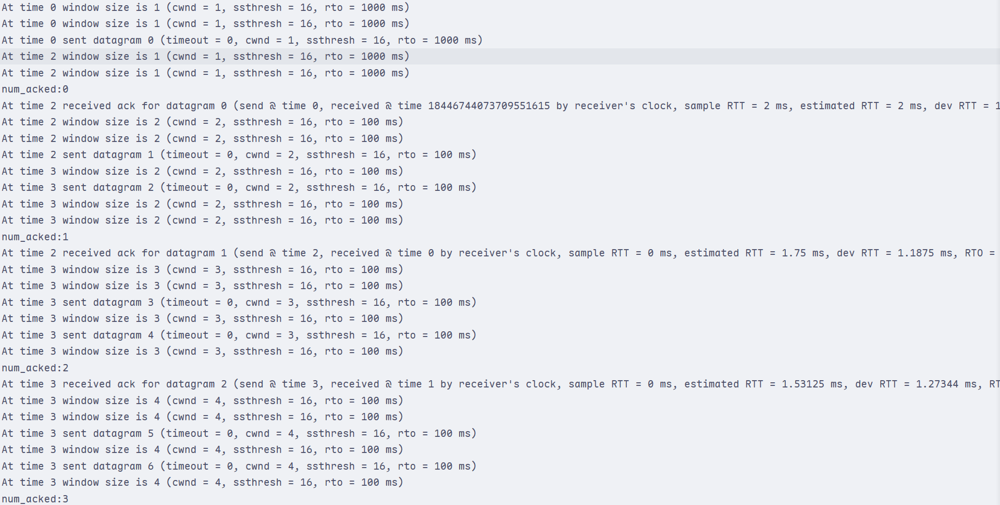
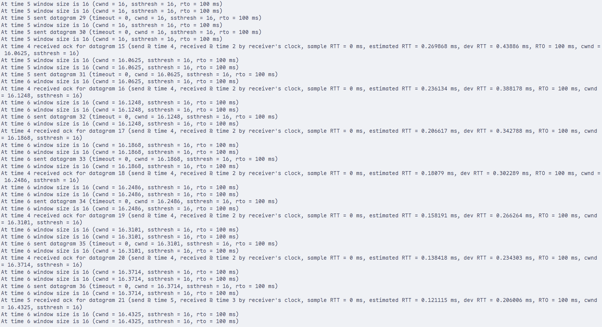
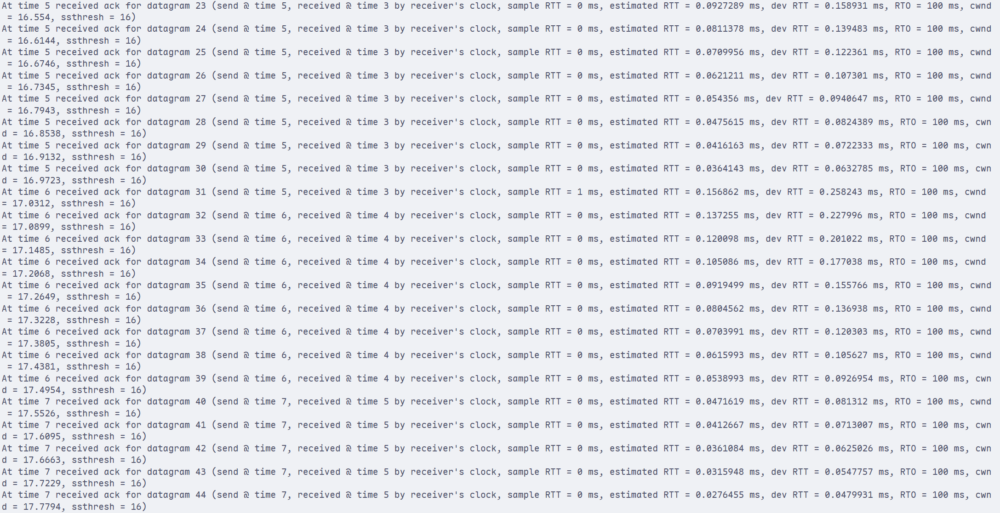
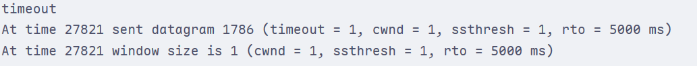
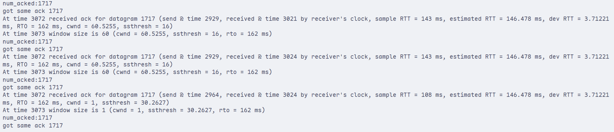

# 实验报告：RTO估计与AIMD拥塞控制实现

<div style="text-align:center">
    王艺杭<br>
    2023202316
</div>

## 实验任务与目标

### 任务背景

前几个实验已经实现了基本的数据发送、ACK反馈和丢包检测机制。发送端虽然能够在超时或重复ACK时发现异常，但原有控制器仍然使用固定发送窗口和固定超时时间，无法根据链路状态动态调整发送速率。在真实网络中，链路时延和排队长度会不断变化，如果超时时间设置过短，容易产生不必要的重传和降窗；如果设置过长，又会降低异常恢复速度。

本次实验在 `controller.cc` 中实现两个核心机制：

1. 基于RTT采样动态估计RTO，使超时判断能随链路时延变化而调整
2. 基于AIMD算法动态调整拥塞窗口，使发送速率能够在探测带宽和避免拥塞之间取得平衡

### 任务目标

1. 使用ACK携带的发送端时间戳计算 `SampleRTT`
2. 根据 `EstimatedRTT` 和 `DevRTT` 动态计算 `RTO`
3. 在 `timeout_ms()` 中返回动态RTO，而不是固定的1000ms
4. 实现AIMD拥塞控制，包括慢启动、拥塞避免和乘法减少
5. 保留重复ACK检测，并在连续3个重复ACK时触发拥塞响应
6. 保持 `Controller` 的公开接口不变，不修改 `sender.cc` 和协议格式

---

## 实验原理与机制说明

### RTT与RTO估计

RTT表示从发送端发出数据报文到收到对应ACK之间的往返时间。本实验中，发送端在发送数据报文时会写入 `send_timestamp`，接收端返回ACK时会把该字段放入 `ack_send_timestamp`。因此控制器收到ACK后，可以用发送端本地时钟计算：

```text
SampleRTT = timestamp_ack_received - send_timestamp_acked
```

由于发送时间和ACK接收时间都来自发送端本机时钟，这种计算不依赖接收端时钟，避免了两端时钟不同步带来的误差。

单个 `SampleRTT` 可能受到瞬时排队、调度延迟或链路波动影响，因此不能直接作为RTO。本实验采用指数加权移动平均估计平滑RTT：

```text
EstimatedRTT = 0.875 * EstimatedRTT + 0.125 * SampleRTT
```

同时使用 `DevRTT` 跟踪RTT样本相对估计值的偏差：

```text
DevRTT = 0.75 * DevRTT + 0.25 * |SampleRTT - EstimatedRTT|
```

最终RTO计算公式为：

```text
RTO = EstimatedRTT + 4 * DevRTT
```

第一条ACK到达前还没有历史估计值，因此初始化规则如下：

```text
EstimatedRTT = SampleRTT
DevRTT = SampleRTT / 2
```

为了避免RTO过小导致频繁误超时，或过大导致恢复过慢，本实验为RTO设置上下界：

```text
100ms <= RTO <= 5000ms
```

### AIMD拥塞控制

AIMD由“加性增大”和“乘性减小”组成。正常收到ACK时，发送端逐步增大发送窗口以探测更多可用带宽；检测到拥塞时，发送端迅速降低窗口，减少对链路的压力。

本实验维护两个关键变量：

```text
cwnd      当前拥塞窗口
ssthresh  慢启动门限
```

初始状态为：

```text
cwnd = 1
ssthresh = 16
```

当 `cwnd < ssthresh` 时，控制器处于慢启动阶段。每收到一个新的ACK，窗口增加1：

```text
cwnd = cwnd + 1
```

由于一个RTT内大约会收到 `cwnd` 个ACK，所以慢启动阶段窗口近似按指数增长，可以快速探测链路容量。

当 `cwnd >= ssthresh` 时，控制器进入拥塞避免阶段。每收到一个新的ACK，窗口增加 `1 / cwnd`：

```text
cwnd = cwnd + 1 / cwnd
```

这样一个RTT内总增长量约为1，实现线性增长，避免窗口扩张过快。

### 拥塞信号与乘法减少

本实验使用两类拥塞信号：

1. `datagram_was_sent()` 中的 `after_timeout == true`
2. `ack_received()` 中连续3个重复ACK

发生拥塞后执行乘法减少：

```text
ssthresh = max(cwnd / 2, 1)
cwnd = 1
```

超时发生时还会对RTO做一次温和退避：

```text
RTO = min(RTO * 2, 5000ms)
```

这样可以在链路持续拥塞时减少过于频繁的超时触发。

---

## 实验过程与实现细节

### 修改 `controller.hh`

为了保存RTO估计和AIMD状态，在 `Controller` 中新增如下私有成员：

```cpp
double cwnd_;
double ssthresh_;

uint64_t last_ack_;
bool has_last_ack_;
unsigned int duplicate_ack_count_;

bool has_rtt_sample_;
double estimated_rtt_ms_;
double dev_rtt_ms_;
unsigned int rto_ms_;
```

其中：

- `cwnd_` 保存当前拥塞窗口，使用 `double` 便于拥塞避免阶段执行 `1 / cwnd` 的小步增长
- `ssthresh_` 保存慢启动门限
- `last_ack_` 和 `has_last_ack_` 用于判断ACK是否重复
- `duplicate_ack_count_` 记录连续重复ACK数量
- `has_rtt_sample_` 标记是否已经完成第一次RTT初始化
- `estimated_rtt_ms_`、`dev_rtt_ms_` 和 `rto_ms_` 分别保存RTT估计、偏差估计和当前RTO

`Controller` 的公开接口保持不变，因此 `sender.cc` 不需要任何修改。

### 修改 `window_size()`

原实现中窗口大小固定为50。本次实验改为根据 `cwnd_` 动态返回：

```cpp
const unsigned int current_window =
    max(1u, static_cast<unsigned int>(cwnd_));
```

这样可以保证返回给发送端的窗口至少为1，不会因为取整导致发送窗口变为0。

在debug模式下，函数还会打印当前 `cwnd`、`ssthresh` 和 `RTO`，便于观察窗口变化过程。

### 修改 `ack_received()`

每收到一个ACK后，控制器首先计算RTT样本并更新RTO：

```cpp
const double sample_rtt_ms =
    static_cast<double>(timestamp_ack_received - send_timestamp_acked);
```

如果这是第一条RTT样本，则初始化：

```cpp
estimated_rtt_ms_ = sample_rtt_ms;
dev_rtt_ms_ = sample_rtt_ms / 2.0;
```

否则按公式更新：

```cpp
estimated_rtt_ms_ =
    0.875 * estimated_rtt_ms_ + 0.125 * sample_rtt_ms;
dev_rtt_ms_ =
    0.75 * dev_rtt_ms_ +
    0.25 * fabs(sample_rtt_ms - estimated_rtt_ms_);
rto_ms_ = clamp_rto(estimated_rtt_ms_ + 4.0 * dev_rtt_ms_);
```

随后根据ACK类型调整窗口：

- 如果ACK号等于上一条ACK号，则认为是重复ACK，输出 `got same ack <seq>` 并累加重复ACK计数
- 如果连续重复ACK达到3次，则触发乘法减少
- 如果ACK号是新的更大ACK，则清空重复ACK计数，并按慢启动或拥塞避免规则增大窗口
- 如果ACK号比上一条ACK更小，则认为是旧ACK，不推进 `last_ack_`，也不增大窗口

### 修改 `datagram_was_sent()`

发送端主循环在 `poll()` 超时时会调用：

```cpp
send_datagram(true);
```

因此控制器可以在 `datagram_was_sent()` 中通过 `after_timeout` 判断是否发生超时。如果发生超时，则输出：

```text
timeout
```

并执行：

```cpp
ssthresh_ = max(cwnd_ / 2.0, 1.0);
cwnd_ = 1.0;
duplicate_ack_count_ = 0;
rto_ms_ = min(MAX_RTO_MS, max(MIN_RTO_MS, rto_ms_ * 2));
```

### 修改 `timeout_ms()`

原实现固定返回1000ms：

```cpp
return 1000;
```

本次实验改为返回动态RTO：

```cpp
return rto_ms_;
```

这样发送端等待ACK的时长会随当前链路RTT估计自动变化。

---

## 实验验证与结果分析

### 初始窗口与慢启动验证

以debug模式运行发送端：

```bash
./sender <host> <port> debug
```

可以观察到初始窗口从1开始。每收到新的ACK，慢启动阶段执行 `cwnd += 1`，窗口会快速增长：

```text
cwnd = 1 -> 2 -> 3 -> 4 -> ...
```

当窗口达到 `ssthresh = 16` 后，控制器进入拥塞避免阶段。



### 拥塞避免验证

进入拥塞避免阶段后，每个ACK只增加 `1 / cwnd`。因此窗口不再快速翻倍，而是接近每个RTT增加1个报文：

```text
cwnd = cwnd + 1 / cwnd
```

debug输出中可以观察到 `cwnd` 以较小步长增长，说明线性增长逻辑生效。



### RTO动态更新验证

收到ACK后，debug输出会显示：

```text
sample RTT = ...
estimated RTT = ...
dev RTT = ...
RTO = ...
```

当链路时延较稳定时，`DevRTT` 会逐渐下降，RTO会接近平滑RTT；当时延波动增大时，`DevRTT` 会上升，RTO也会随之增大，从而降低误超时概率。



### 超时降窗验证

如果发送端在当前RTO内没有收到ACK，`poll()` 会超时，随后控制器输出：

```text
timeout
```

此时执行乘法减少：

```text
ssthresh = max(cwnd / 2, 1)
cwnd = 1
```

并对RTO执行一次退避，减少连续超时导致的频繁探测。



### 重复ACK降窗验证

在发生丢包或乱序时，接收端会持续返回最后一个按序收到的数据报文序号，发送端会观察到重复ACK：

```text
got same ack <seq>
```

当连续重复ACK达到3次时，控制器认为链路出现拥塞并执行乘法减少：

```text
ssthresh = max(cwnd / 2, 1)
cwnd = 1
```



---

## 总结

本次实验将控制器从固定窗口、固定超时时间的简单实现，扩展为能够根据链路反馈动态调整的拥塞控制器。RTO估计使超时判断能适应当前网络时延；AIMD机制使窗口在正常情况下逐步增长，在检测到拥塞时快速回退。两者结合后，发送端可以更合理地利用链路带宽，并在拥塞或丢包时降低发送压力。
